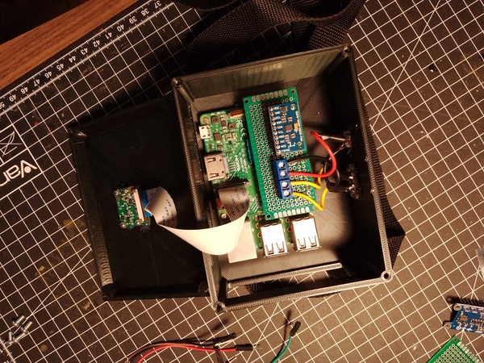

# Capping for mapping
Codes I've used for recording video and IMU data for structure from motion (SfM) based mapping. The code is executed on a self-made data gathering unit, which utilises a Raspberry Pi 3 (Raspbian Buster), Raspberry Pi camera, and MPU9250 IMU on a breakout board.



## Install requirements
```
sudo apt-get install python3-picamera
pip3 install -r requirements.txt
```
## Usage
Calibrate IMU with
```
python3 imu.py
```
Enter recording mode with
```
python3 capture.py
```
